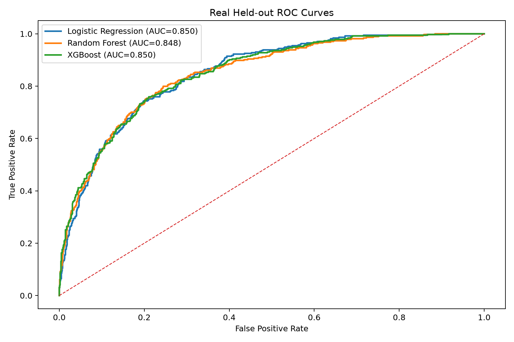
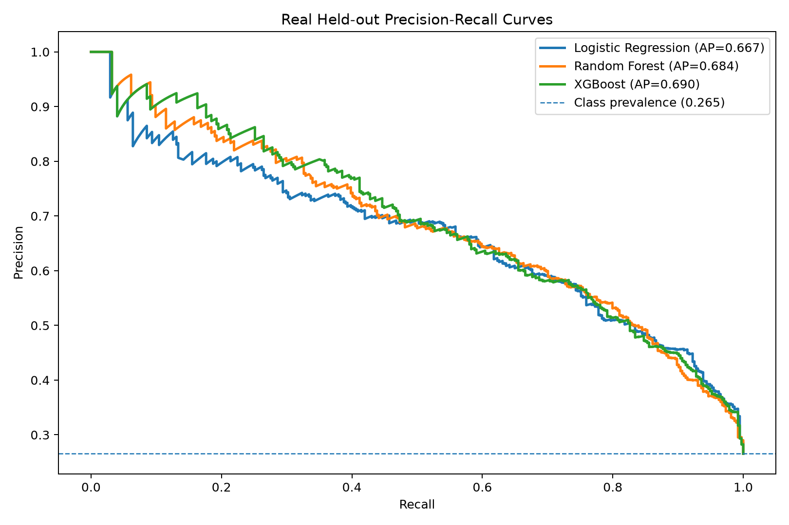

# Customer Churn Intelligence Dashboard

An end-to-end machine-learning portfolio project that analyses telecommunications customer churn, compares three classification models, and serves customer-level predictions through an interactive Streamlit application.

The project is a deployment-ready analytical prototype rather than a production decision system.

## Project Overview

The project uses the IBM Telco Customer Churn dataset to:

1. Clean and explore 7,043 customer records.
2. Engineer demographic, service, contract and billing features.
3. Train Logistic Regression, Random Forest and XGBoost models.
4. Tune models using cross-validation.
5. Select model-specific thresholds on a validation set.
6. Explain predictions with SHAP.
7. Serve predictions through Streamlit.

## Dataset

| Property | Value |
|---|---:|
| Customer records | 7,043 |
| Original columns | 21 |
| Target | `Churn` |
| Non-churn customers | Approximately 73.5% |
| Churn customers | Approximately 26.5% |

Download the IBM Telco Customer Churn dataset from Kaggle and place this file in the repository root:

```text
WA_Fn-UseC_-Telco-Customer-Churn.csv
```

## Methodology

### Data preparation

- Converts `TotalCharges` to numeric.
- Handles blank charge values.
- Removes the customer identifier.
- Encodes binary variables.
- One-hot encodes multi-category variables.
- Creates tenure-group features.

### Data split

- 70% training
- 10% validation
- 20% test

The scaler is fitted only on training data. Thresholds are selected on validation data, while the test set remains separate.

### Models

| Model | Role |
|---|---|
| Logistic Regression | Interpretable baseline |
| Random Forest | Non-linear ensemble comparison |
| XGBoost | Strongest overall predictive model |

### Evaluation

Models are compared using ROC AUC, precision, recall, F1, confusion matrices and precision-recall curves.

The executed notebook remains the source of truth for exact model results because values may vary with the split, seed, package versions and tuning grid.

## Key Findings

Important churn indicators include:

- Short tenure
- Month-to-month contracts
- Higher monthly charges
- Electronic-check payment
- Fibre-optic internet
- Lack of online security or technical support

These relationships are observational, not causal.

## Streamlit Application

The dashboard allows a user to:

- Enter a complete customer profile
- Select one of three models
- View churn probability and threshold
- View a low-, medium- or high-risk segment
- Inspect SHAP feature contributions
- Compare model outputs
- Inspect real held-out ROC and precision-recall curves

Gender is now collected explicitly because it was used during model training. The app no longer inserts a hidden hard-coded gender value during inference.

## Repository Structure

```text
customer-churn/
├── app.py
├── README.md
├── requirements.txt
├── requirements-dev.txt
├── runtime.txt
├── .devcontainer/
│   └── devcontainer.json
├── notebooks/
│   └── churn_analysis.ipynb
├── models/
│   ├── logistic_model.pkl
│   ├── random_forest_model.pkl
│   ├── xgb_model.pkl
│   ├── scaler.pkl
│   ├── feature_columns.pkl
│   └── thresholds.pkl
├── tests/
│   └── test_model_assets.py
└── assets/
    ├── plots/
    └── screenshots/
```

## Run the Existing App

```bash
git clone https://github.com/Shakya658/customer-churn.git
cd customer-churn
python -m venv .venv
pip install -r requirements.txt
streamlit run app.py
```

The committed model artefacts allow the app to run without retraining.

## Reproduce the Analysis

1. Place `WA_Fn-UseC_-Telco-Customer-Churn.csv` in the repository root.
2. Install the notebook environment:

```bash
pip install -r requirements-dev.txt
```

3. Open the notebook:

```bash
jupyter notebook notebooks/churn_analysis.ipynb
```

4. Run all cells to regenerate the model artefacts.

## Training and Inference Contract

At inference time the app:

1. Builds a one-row customer record.
2. Applies the training-time binary mappings.
3. One-hot encodes categorical variables.
4. Creates tenure-group indicators.
5. Reindexes against `feature_columns.pkl`.
6. Fills absent dummy columns with zero.
7. Applies scaling only to Logistic Regression.

## Artefact Smoke Test

The smoke test verifies that all six model artefacts exist, load successfully, contain a non-empty feature list, and include valid thresholds for all three models.

Run:

```bash
pytest tests/test_model_assets.py
```

## Dependencies

- `requirements.txt` contains pinned application dependencies and includes Joblib.
- `requirements-dev.txt` contains the notebook and modelling environment, including Jupyter and Seaborn.

Use the pinned versions when loading the committed serialized models.

## Real Held-out Evaluation Curves

The Streamlit ROC and precision-recall charts use predictions from the untouched 20% test split rather than simulated values. The committed models are scored without retraining, and the curve points are stored in `assets/evaluation/model_curves.json`.

The test split contains **1,409 customers**, including **374 churn cases** (26.5% positive rate).

| Model | ROC AUC | Average Precision |
|---|---:|---:|
| Logistic Regression | 0.850 | 0.667 |
| Random Forest | 0.848 | 0.684 |
| XGBoost | 0.850 | 0.690 |

The export workflow verifies the 7,043-row source dataset, reconstructs the notebook test split, validates the generated arrays and checks the application syntax before committing the evaluation artefact.

## Evaluation Plots

### Real held-out ROC curves



### Real held-out precision-recall curves



## Limitations

- The project uses a public sample dataset rather than live company data.
- It does not include service outages, competitor offers or retention-campaign outcomes.
- Predictions should support investigation rather than automatically determine treatment.
- SHAP explains model behaviour and does not establish causality.
- The app does not include production monitoring, authentication, drift detection or automated retraining.

## Tech Stack

Python, Pandas, NumPy, Scikit-learn, XGBoost, SHAP, Matplotlib, Seaborn, Streamlit and Joblib.

## Author

**Shirish Man Shakya**  
Data Analyst | Business Intelligence | Predictive Analytics

- [Portfolio](https://shakya658.github.io/portfolio/)
- [LinkedIn](https://linkedin.com/in/shirish-man-shakya)
- [GitHub](https://github.com/Shakya658)
